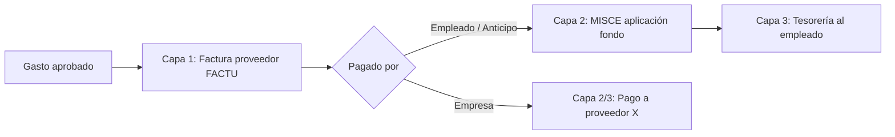

# Manual de Usuario — Gastos Fiscal HN + Anticipo Empleado

**Empresa:** Empresa de Soluciones Industriales S de R.L. (EMSOIND)  
**Módulo:** Kenocia Gastos Fiscal HN (`kc_expense_fiscal_hn_v18`)  
**Versión del manual:** 1.1 — Julio 2026  
**Versión del módulo:** 18.0.2.1.0  
**Base de referencia:** EMSOIND_PRUEBA

---

## Índice

1. [¿Para qué sirve este módulo?](#1-para-qué-sirve-este-módulo)
2. [Cuentas y diarios EMSOIND](#2-cuentas-y-diarios-emsoind)
3. [Regla de oro antes de empezar](#3-regla-de-oro-antes-de-empezar)
4. [Las capas contables (cómo piensa el sistema)](#4-las-capas-contables-cómo-piensa-el-sistema)
5. [Escenario 1 — Reembolso sin anticipo](#5-escenario-1--reembolso-sin-anticipo)
6. [Escenario 2 — Empresa pagó (tarjeta/banco)](#6-escenario-2--empresa-pagó-tarjetabanco)
7. [Escenario 3 — Anticipo cuadrado](#7-escenario-3--anticipo-cuadrado)
8. [Escenario 4 — Anticipo con diferencia (sobrante o faltante)](#8-escenario-4--anticipo-con-diferencia-sobrante-o-faltante)
9. [Cómo se paga el reembolso al empleado](#9-cómo-se-paga-el-reembolso-al-empleado)
10. [Checklist rápido por rol](#10-checklist-rápido-por-rol)
11. [Preguntas frecuentes](#11-preguntas-frecuentes)

---

## 1. ¿Para qué sirve este módulo?

Este módulo permite que los gastos de empleados queden registrados **como compras fiscales reales** (factura o boleta del proveedor a nombre de la empresa), cumplan con el **libro de compras SAR** y el crédito ISV, y al mismo tiempo controlen de dónde salió el dinero:

- **Empleado pagó (reembolso)** — el empleado adelantó con su dinero/tarjeta personal.  
- **Empresa pagó (tarjeta/banco)** — se usó tarjeta o cuenta corporativa.  
- **Anticipo** — la empresa ya entregó fondo al empleado y luego se liquida.

**Menús principales en Odoo:**

| Menú | Uso |
|------|-----|
| **Gastos → Mis gastos** | El empleado carga cada gasto con proveedor y documento fiscal |
| **Gastos → Reportes de gastos** | Agrupa gastos y los envía a aprobación |
| **Gastos → Anticipos a Empleados** | Contabilidad entrega fondos antes del viaje/compra |
| **Contabilidad → Facturas de proveedor** | Facturas FACTU generadas automáticamente |
| **Contabilidad → Proveedores → Pagos** | Pago del reembolso al empleado o pago al proveedor (modo empresa) |

---

## 2. Cuentas y diarios EMSOIND

Use esta tabla como referencia al revisar asientos. Los códigos corresponden al plan contable de EMSOIND.

| Concepto | Código / Diario | Nombre en Odoo |
|----------|-----------------|----------------|
| Anticipo a empleado | **11203** | Cuentas por Cobrar Empleados |
| Proveedores (CxP) | **21101** | Proveedores |
| Banco principal | **11103** | Bac Honduras L 730191111 |
| ISV compras | **11301** | Impuesto por Cobrar |
| Gasto (ejemplos) | **61238**, **61256**, **51120** | Uniforme Personal, Combustibles, Costos de Ventas |
| Diario facturas compra | **FACTU** | Facturas de proveedores |
| Diario aplicación fondo | **MISCE** | Operaciones varias |
| Diario banco | **BNK1** | BAC LPS - 730191111 |

> **Nota para contabilidad:** La cuenta de reembolso al empleado está configurada hoy en **21101 Proveedores**. Se recomienda crear una cuenta CxP dedicada al empleado (por ejemplo `211xx`) para no mezclar saldos con proveedores reales.

---

## 3. Regla de oro antes de empezar

### Separe siempre dos ideas

| Concepto | Campo en Odoo | Ejemplo |
|----------|---------------|---------|
| **Proveedor fiscal** | Proveedor | Comercio X (factura a nombre de la empresa) |
| **Quién desembolsó** | Pagado por | Empleado / Empresa / (anticipo aparte) |

Solo se reembolsan o registran compras **a nombre de la empresa** (RTN de la compañía). Así el ISV es crédito fiscal válido.

### Campo **Pagado por** (etiquetas)

| Opción | Cuándo usarla |
|--------|----------------|
| **Empleado pagó (reembolso)** | El empleado pagó con su tarjeta/efectivo y la empresa le debe devolver |
| **Empresa pagó (tarjeta/banco)** | Se pagó con tarjeta o cuenta de la empresa; **no** hay reembolso al empleado |

> El **proveedor** se elige **siempre** (en ambos modos). Indica el comercio de la factura/boleta, no quién adelantó el dinero.


*Figura 4 — Ejemplo de línea de gasto. Verifique proveedor, tipo de documento, número y cuenta de gasto.*

| Campo obligatorio | Qué poner |
|-------------------|-----------|
| **Proveedor** | El comercio que emitió la factura/boleta (RTN del proveedor) |
| **Pagado por** | Empleado pagó (reembolso) **o** Empresa pagó (tarjeta/banco) |
| **Tipo documento** | Boleta, Factura (CAI), etc. |
| **Nº documento** | Correlativo fiscal |
| **CAI** | Solo si es Factura (FA) y la empresa es mediana/grande |
| **Cuenta** | Cuenta de gasto según el producto (ej. 61256 Combustibles) |

### Ejemplo de documento fiscal de referencia


*Figura 0 — Datos que debe transcribir del documento físico: RTN proveedor, número, fecha, CAI (si aplica) e ISV.*

---

## 4. Las capas contables (cómo piensa el sistema)

La **capa 1 (FACTU)** es igual en todos los modos fiscales: compra al proveedor + ISV + libro SAR.

Las capas 2 y 3 cambian según quién desembolsó:



| Capa | Qué hace | Diario | Cuentas típicas |
|------|----------|--------|-----------------|
| **1. Factura proveedor** | Registra la compra fiscal ante el proveedor | FACTU | Dr Gasto + Dr ISV / Cr **21101** (partner = proveedor) |
| **2. Aplicación fondo** | Solo reembolso/anticipo: cruza CxP del proveedor con reembolso o anticipo del empleado | MISCE | Dr **21101** proveedor / Cr **11203** o Cr CxP empleado |
| **3. Tesorería** | Reembolso: paga al **empleado**. Empresa: paga al **proveedor** (o concilia tarjeta) | BNK1 | Según escenario |

### Capa 1 — Factura de proveedor (FACTU)


*Figura 3 — Factura `FACTU/...`: el contacto es el **proveedor**, no el empleado.*

**Con ISV 15% (ejemplo total L 1,000 = base L 869.57 + ISV L 130.43):**

| Cuenta | Debe | Haber | Partner |
|--------|------|-------|---------|
| 51120 Costos de Ventas (o cuenta gasto) | 869.57 | | — |
| 11301 Impuesto por Cobrar | 130.43 | | — |
| 21101 Proveedores | | 1,000.00 | Proveedor X |

---

## 5. Escenario 1 — Reembolso sin anticipo

**Cuándo aplica:** El empleado (ej. Jorge) pagó de su bolsillo/tarjeta personal y **no** tiene anticipo abierto. La factura está a nombre de la empresa.

**Ejemplo:** Jorge — boleta/factura L 1,000 al proveedor X.

### Paso a paso

| Paso | Quién | Acción en Odoo |
|------|-------|----------------|
| 1 | Empleado | Crea gasto en **Mis gastos**: Pagado por = **Empleado pagó (reembolso)**, proveedor X, datos fiscales |
| 2 | Empleado | Crea **Reporte de gastos**, agrega líneas y **Envía** |
| 3 | Aprobador | Aprueba el reporte |
| 4 | Contabilidad | **Publica asientos** |
| 5 | Sistema | Genera factura FACTU por cada línea → luego MISCE (factura queda **Pagada**) |
| 6 | Sistema | Deja CxP abierta a nombre del **empleado** (contacto de trabajo) |
| 7 | Tesorería | Registra **pago bancario al empleado** (ver sección 9) |

### Asientos (ejemplo L 1,000 con ISV)

**Paso 4a — Factura proveedor (FACTU):** ver tabla de la sección 4.

**Paso 4b — Aplicación fondo (MISCE):**

| Cuenta | Debe | Haber | Partner |
|--------|------|-------|---------|
| 21101 Proveedores | 1,000.00 | | Proveedor X |
| 21101 / 211xx reembolso* | | 1,000.00 | **Jorge** |

*\* Idealmente cuenta CxP empleado dedicada.*

**Paso 7 — Pago tesorería (BNK1) al empleado:**

| Cuenta | Debe | Haber | Partner |
|--------|------|-------|---------|
| CxP reembolso | 1,000.00 | | Jorge |
| 11103 Bac Honduras | | 1,000.00 | — |

### Resultado esperado

- Libro de compras: línea con correlativo del documento.  
- Proveedor X: saldo **0**.  
- Empleado: saldo **0** después del pago bancario.  
- **No** se usa la cuenta **11203** en este escenario.

---

## 6. Escenario 2 — Empresa pagó (tarjeta/banco)

**Cuándo aplica:** La compra se pagó con **tarjeta o banco de la empresa**. No hay reembolso al empleado. La factura sigue a nombre de la empresa y debe ir al libro SAR.

### Paso a paso

| Paso | Quién | Acción |
|------|-------|--------|
| 1 | Empleado / Contabilidad | Gasto con Pagado por = **Empresa pagó (tarjeta/banco)**, proveedor X, datos fiscales |
| 2 | Empleado | Reporte → Envía → Aprobación |
| 3 | Contabilidad | **Publica asientos** |
| 4 | Sistema | Genera FACTU (proveedor X) en estado **No pagada** — **sin** MISCE de reembolso |
| 5 | Tesorería | Paga la factura desde **Contabilidad → Facturas de proveedor**, o concilia con el estado de cuenta de la tarjeta corporativa |

### Asientos

**Capa 1 — FACTU:** igual que sección 4 (gasto + ISV / CxP proveedor X).

**Capa pago — BNK1 (o conciliación de tarjeta):**

| Cuenta | Debe | Haber | Partner |
|--------|------|-------|---------|
| 21101 Proveedores | 1,000.00 | | Proveedor X |
| 11103 Banco / CxP tarjeta | | 1,000.00 | — |

### Resultado esperado

- Libro de compras e ISV: iguales que en reembolso.  
- Empleado: **sin** saldo por pagar.  
- Proveedor X: queda pendiente hasta el pago/conciliación corporativa.  
- No vincule este modo a un **anticipo** (el sistema lo bloquea).

---

## 7. Escenario 3 — Anticipo cuadrado

**Cuándo aplica:** La empresa entrega dinero **antes** y el empleado gasta **exactamente** ese monto. Use Pagado por = **Empleado pagó (reembolso)** y vincule el anticipo en el reporte.

**Ejemplo QAS:** Estuardo Madrid — anticipo L 8,000; dos gastos de L 4,000 c/u.

### Paso a paso

| Paso | Quién | Acción |
|------|-------|--------|
| 1 | Contabilidad | **Anticipos a Empleados → Crear** — monto, cuenta 11203, diario BNK1 |
| 2 | Contabilidad | Botón **Entregar** (genera pago banco) |
| 3 | Empleado | Carga gastos (reembolso + proveedor) y los vincula al anticipo en el reporte |
| 4 | Aprobador | Aprueba y contabilidad **publica** |
| 5 | Contabilidad | **Liquidar anticipo** → wizard indica saldo **0** → **Cerrar** |

### Pantallas de referencia


*Figura 1 — Anticipo `ANT/2026/0001`: cuenta 11203, total gastado y saldo pendiente.*


*Figura 2 — Entrega: Dr 11203 / Cr banco.*

### Asientos (por cada gasto L 4,000)

**Entrega anticipo:**

| Cuenta | Debe | Haber |
|--------|------|-------|
| 11203 CxC Empleados | 8,000.00 | |
| 11103 Banco | | 8,000.00 |

**FACTU + MISCE (resumen por gasto):**

| Cuenta | Debe | Haber |
|--------|------|-------|
| Gasto (+ ISV si aplica) | … | |
| 21101 Proveedores | | 4,000.00 |
| Luego MISCE: 21101 | 4,000.00 | |
| 11203 | | 4,000.00 |

### Resultado esperado

| Concepto | Valor |
|----------|-------|
| Cuenta 11203 del empleado | **0** |
| Anticipo | Estado **Cerrado** |

---

## 8. Escenario 4 — Anticipo con diferencia (sobrante o faltante)

**Cuándo aplica:** El empleado **no gastó todo** el anticipo (sobrante) o **gastó más** de lo entregado (faltante/excedido).

### Sobrante (vuelto)

Al **Liquidar anticipo**, el wizard registra el vuelto a banco (Dr banco / Cr 11203) y cierra.

> El empleado debe **devolver el efectivo** o autorizar descuento según política interna antes de cerrar.

### Faltante / excedido

El MISCE puede repartir: parte contra 11203 y el excedente como CxP al empleado. Luego tesorería paga solo el excedente al empleado (misma lógica de la sección 9).

| Situación | Saldo anticipo | Acción |
|-----------|----------------|--------|
| **Sobrante** | Saldo > 0 | Vuelto a banco al liquidar |
| **Excedido** | Anticipo agotado + CxP empleado | Pagar reembolso al empleado |

---

## 9. Cómo se paga el reembolso al empleado

Odoo **no crea una factura “a nombre de Jorge”**. Tras publicar un reembolso fiscal, el asiento MISCE deja un **saldo contable a favor del empleado** (partner = contacto de trabajo) en la cuenta de reembolso.

### Cómo lo ve tesorería

1. Contabilidad → Proveedores → **Deudas** / envejecimiento, filtrando el contacto del empleado, **o**  
2. Abrir la ficha del contacto de Jorge → ver deuda pendiente, **o**  
3. Contabilidad → Proveedores → **Pagos** → partner = Jorge → Odoo propone el apunte abierto del MISCE.

### Cómo registrar el pago

1. **Contabilidad → Proveedores → Pagos** (partner = empleado).  
2. Diario banco (BNK1), importe = total a reembolsar.  
3. Conciliar el apunte “Reembolso empleado — …”.  
4. Publicar.

> En reportes fiscales **no** use el botón **Registrar pago** del reporte: está bloqueado a propósito. El pago es al empleado por tesorería, no a la factura del comercio (esa ya se canceló con el MISCE).

### Requisitos

- El empleado debe tener **contacto de trabajo**.  
- Ese contacto debe tener cuenta por pagar (o la compañía debe tener cuenta de reembolso configurada en Ajustes → Gastos).

---

## 10. Checklist rápido por rol

### Empleado

- [ ] **Proveedor** siempre indicado (comercio de la factura)  
- [ ] **Pagado por** correcto: reembolso vs empresa  
- [ ] Número de documento, fecha y CAI (si aplica)  
- [ ] Adjuntar foto/PDF del documento  
- [ ] Si hay anticipo: modo reembolso + seleccionar anticipo en el reporte  

### Aprobador

- [ ] Monto coincide con documento adjunto  
- [ ] Factura a nombre de la empresa  
- [ ] Cuenta de gasto y analítica correctas  
- [ ] Tipo documento coherente (boleta vs factura CAI)  

### Contabilidad / Tesorería

- [ ] Publicar reporte genera FACTU (+ MISCE si es reembolso/anticipo)  
- [ ] Reembolso: factura proveedor **Pagada**; pagar CxP del **empleado**  
- [ ] Empresa pagó: factura proveedor **pendiente**; pagar/conciliar a **proveedor X**  
- [ ] Anticipo: verificar total gastado vs saldo y liquidar  
- [ ] Verificar línea en **Libro de compras** SAR  

---

## 11. Preguntas frecuentes

### ¿Por qué el proveedor aparece en ambos modos de pago?

Porque el proveedor es el comercio de la factura fiscal. **Pagado por** solo indica quién desembolsó (empleado o empresa). Sin proveedor no hay FACTU ni libro SAR.

### ¿Qué cambió respecto a no usar nunca «Empresa»?

Antes, «Pagado por Empresa» generaba asientos de pago directo **sin** factura SAR. Ahora, si el gasto tiene documento fiscal, también genera **FACTU** al proveedor y deja la factura para pago/conciliación corporativa.


*Figura 5 — Ejemplo del flujo **anterior** sin FACTU. Solo aplica aún a gastos **sin** documento fiscal en modo empresa.*

### ¿Dónde veo la factura generada?

En el reporte de gastos → smart button de movimientos/facturas, o en **Contabilidad → Facturas de proveedor** (diario FACTU).

### ¿Dónde veo la aplicación de fondo (reembolso/anticipo)?

En cada línea de gasto → campo **Asiento aplicación fondo**, o en diario MISCE filtrando por referencia del gasto/reporte.

### ¿Qué pasa si olvido el proveedor?

El sistema **no permite** publicar gastos con documento fiscal sin proveedor.

### ¿Boleta sin ISV está permitida?

Sí. Boletas y documentos OC sin impuesto son válidos; el asiento solo llevará la cuenta de gasto sin 11301.

### Anticipos viejos (ej. ANT/2026/0001)

Los anticipos creados con el flujo anterior pueden tener saldos abiertos en 11203. Coordine con contabilidad para liquidarlos o migrarlos manualmente; los **nuevos** anticipos siguen este manual.

---

## Resumen visual de los escenarios

```
ESCENARIO 1 — REEMBOLSO (sin anticipo)
  Empleado pagó → Gasto → FACTU (Cr 21101 proveedor X)
                     → MISCE (Dr 21101 X / Cr CxP Jorge)
                     → BNK1  pago a Jorge

ESCENARIO 2 — EMPRESA PAGÓ (tarjeta/banco)
  Empresa pagó → Gasto → FACTU (Cr 21101 proveedor X)
                     → BNK1 / tarjeta  pago a X (sin MISCE a empleado)

ESCENARIO 3 — ANTICIPO CUADRADO
  BNK1 entrega → Dr 11203 / Cr banco
  Gastos → FACTU + MISCE (Dr 21101 / Cr 11203)
  Cierre → saldo 0, anticipo cerrado

ESCENARIO 4 — ANTICIPO CON DIFERENCIA
  Sobrante:  cierre → BNK1 vuelto (Dr banco / Cr 11203)
  Excedido:  MISCE split Cr 11203 + Cr CxP empleado → BNK1 paga excedente
```

---

**Soporte técnico:** Kenocia — módulo `kc_expense_fiscal_hn_v18`  
**Documentos relacionados:** `scripts/run_qas_expense_fiscal.py` (pruebas automáticas en EMSOIND_PRUEBA)
