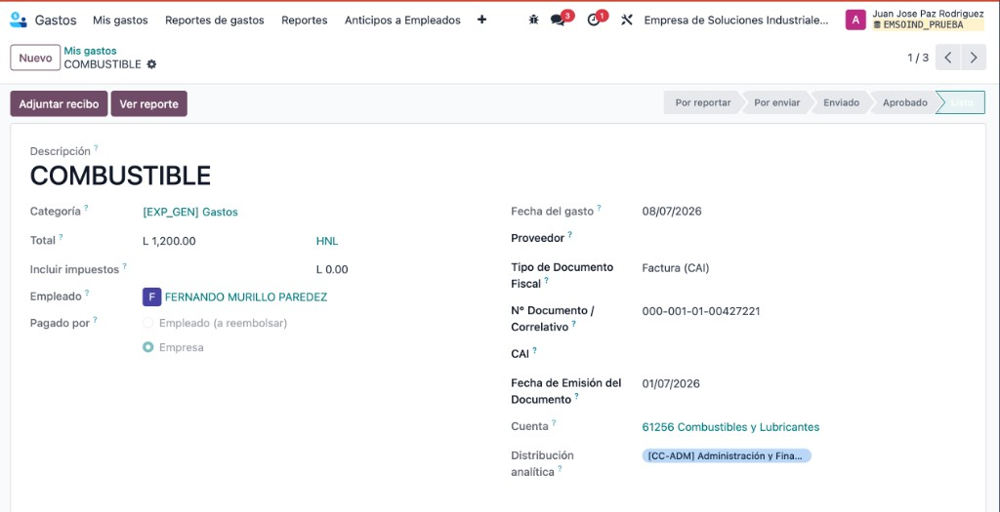
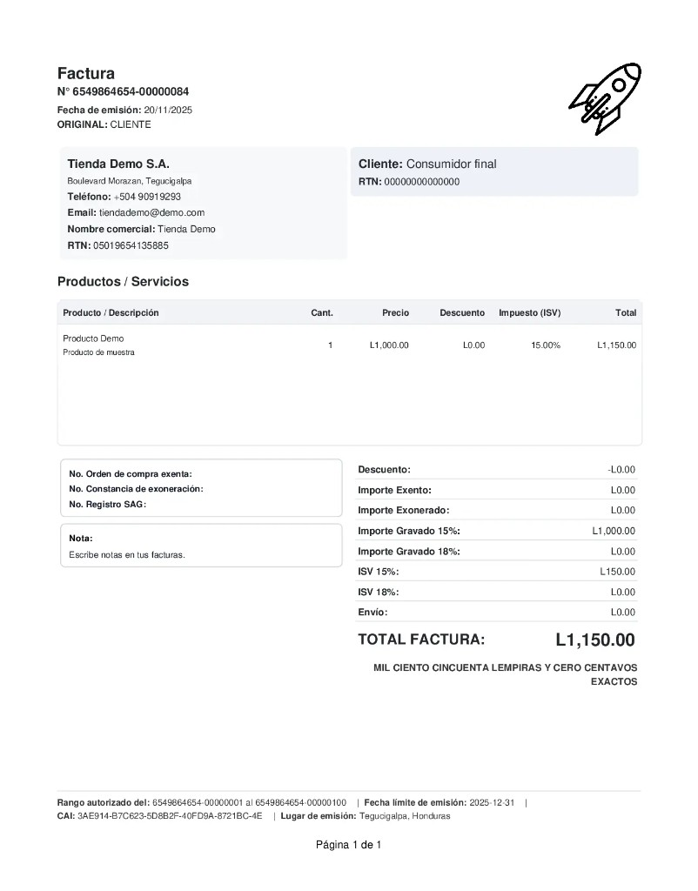
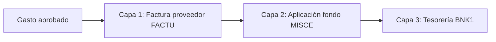
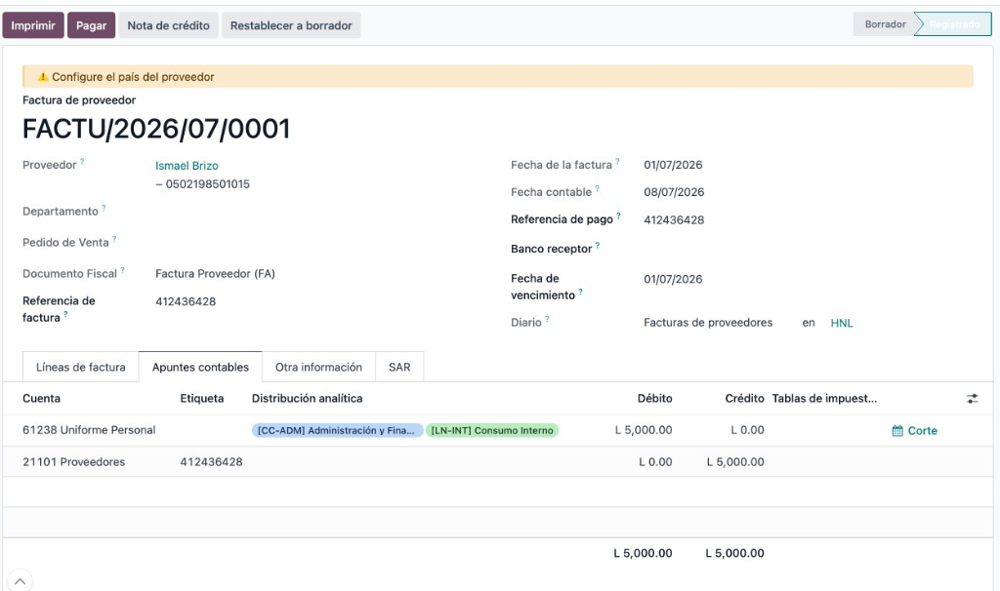
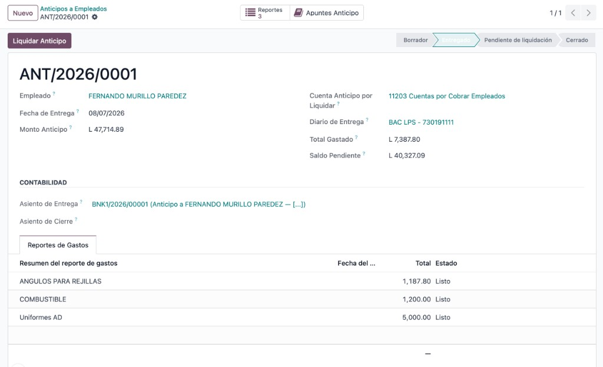
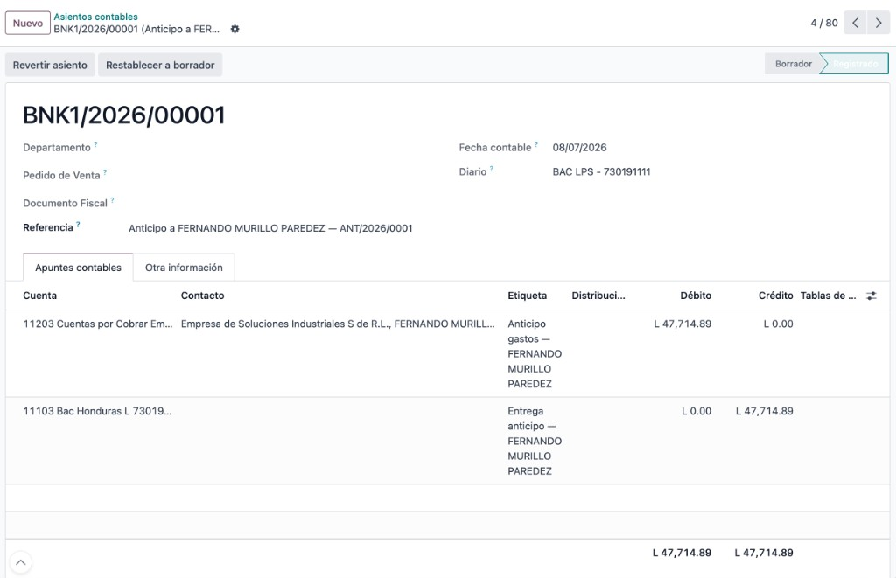
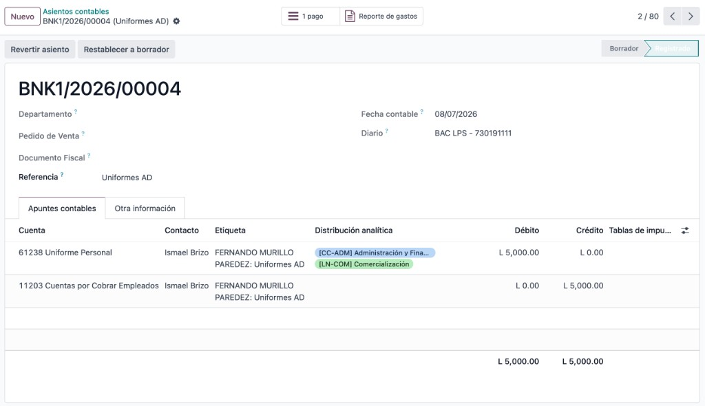

# Manual de Usuario — Gastos Fiscal HN + Anticipo Empleado

**Empresa:** Empresa de Soluciones Industriales S de R.L. (EMSOIND)  
**Módulo:** Kenocia Gastos Fiscal HN (`kc_expense_fiscal_hn_v18`)  
**Versión del manual:** 1.0 — Julio 2026  
**Base de referencia:** EMSOIND_PRUEBA

---

## Índice

1. [¿Para qué sirve este módulo?](#1-para-qué-sirve-este-módulo)
2. [Cuentas y diarios EMSOIND](#2-cuentas-y-diarios-emsoind)
3. [Regla de oro antes de empezar](#3-regla-de-oro-antes-de-empezar)
4. [Las 3 capas contables (cómo piensa el sistema)](#4-las-3-capas-contables-cómo-piensa-el-sistema)
5. [Escenario 1 — Reembolso sin anticipo](#5-escenario-1--reembolso-sin-anticipo)
6. [Escenario 2 — Anticipo cuadrado](#6-escenario-2--anticipo-cuadrado)
7. [Escenario 3 — Anticipo con diferencia (sobrante o faltante)](#7-escenario-3--anticipo-con-diferencia-sobrante-o-faltante)
8. [Checklist rápido por rol](#8-checklist-rápido-por-rol)
9. [Preguntas frecuentes](#9-preguntas-frecuentes)

---

## 1. ¿Para qué sirve este módulo?

Este módulo permite que los gastos de empleados queden registrados **como compras fiscales reales** (factura o boleta del proveedor), cumplan con el **libro de compras SAR**, y al mismo tiempo controlen si el dinero salió de:

- un **anticipo** ya entregado al empleado, o  
- un **reembolso** que la empresa pagará después.

**Menús principales en Odoo:**

| Menú | Uso |
|------|-----|
| **Gastos → Mis gastos** | El empleado carga cada gasto con su documento fiscal |
| **Gastos → Reportes de gastos** | Agrupa gastos y los envía a aprobación |
| **Gastos → Anticipos a Empleados** | Contabilidad entrega fondos antes del viaje/compra |
| **Contabilidad → Facturas de proveedor** | Aquí aparecen las facturas generadas automáticamente |

---

## 2. Cuentas y diarios EMSOIND

Use esta tabla como referencia al revisar asientos. Los códigos corresponden al plan contable de EMSOIND.

| Concepto | Código / Diario | Nombre en Odoo |
|----------|-----------------|----------------|
| Anticipo a empleado | **11203** | Cuentas por Cobrar Empleados |
| Proveedores (CxP) | **21101** | Proveedores |
| Banco principal | **11103** | Bac Honduras L 730191111 |
| ISV compras | **11301** | Impuesto por Cobrar |
| Gasto (ejemplos) | **61238**, **61256**, **51120** | Uniforme Personal, Combustibles, Costos de Ventas |
| Diario facturas compra | **FACTU** | Facturas de proveedores |
| Diario aplicación fondo | **MISCE** | Operaciones varias |
| Diario banco | **BNK1** | BAC LPS - 730191111 |

> **Nota para contabilidad:** La cuenta de reembolso al empleado está configurada hoy en **21101 Proveedores**. Se recomienda crear una cuenta CxP dedicada al empleado (por ejemplo `211xx`) para no mezclar saldos con proveedores reales.

---

## 3. Regla de oro antes de empezar

### Siempre use **«Empleado (a reembolsar)»**

En cada línea de gasto, el campo **Pagado por** debe quedar en:

> **Empleado (a reembolsar)** — *no* «Pagado por Empresa»



*Figura 4 — Ejemplo de línea de gasto. Verifique proveedor, tipo de documento, número y cuenta de gasto.*

| Campo obligatorio | Qué poner |
|-------------------|-----------|
| **Proveedor** | El comercio que emitió la factura/boleta (RTN del proveedor) |
| **Tipo documento** | Boleta, Factura (CAI), etc. |
| **Nº documento** | Correlativo fiscal |
| **CAI** | Solo si es Factura (FA) y la empresa es mediana/grande |
| **Cuenta** | Cuenta de gasto según el producto (ej. 61256 Combustibles) |

### Ejemplo de documento fiscal de referencia



*Figura 0 — Datos que debe transcribir del documento físico: RTN proveedor, número, fecha, CAI (si aplica) e ISV.*

---

## 4. Las 3 capas contables (cómo piensa el sistema)

Cada gasto aprobado genera **hasta 3 movimientos**, en este orden:



| Capa | Qué hace | Diario | Cuentas típicas |
|------|----------|--------|-----------------|
| **1. Factura proveedor** | Registra la compra fiscal ante el proveedor | FACTU | Dr Gasto + Dr ISV / Cr **21101** |
| **2. Aplicación fondo** | Cruza la deuda del proveedor con anticipo o reembolso del empleado | MISCE | Dr **21101** / Cr **11203** o Cr **21101** (empleado) |
| **3. Tesorería** | Pago banco al empleado (solo reembolso o vuelto de anticipo) | BNK1 | Dr CxP empleado / Cr **11103** banco |

### Capa 1 — Factura de proveedor (FACTU)



*Figura 3 — Factura `FACTU/2026/07/0001`: el contacto es el **proveedor**, no el empleado.*

**Asiento típico (sin ISV):**

| Cuenta | Debe | Haber | Partner |
|--------|------|-------|---------|
| 61238 Uniforme Personal (gasto) | 5,000.00 | | — |
| 21101 Proveedores | | 5,000.00 | Proveedor |

**Con ISV 15% (ejemplo L 5,000 base + L 750 ISV):**

| Cuenta | Debe | Haber |
|--------|------|-------|
| 51120 Costos de Ventas (o cuenta gasto) | 5,000.00 | |
| 11301 Impuesto por Cobrar | 750.00 | |
| 21101 Proveedores | | 5,750.00 |

---

## 5. Escenario 1 — Reembolso sin anticipo

**Cuándo aplica:** El empleado pagó de su bolsillo y **no** tiene anticipo abierto.

**Ejemplo QAS:** Alberto Tejada — boleta L 3,000 + factura FA L 5,000 con ISV.

### Paso a paso

| Paso | Quién | Acción en Odoo |
|------|-------|----------------|
| 1 | Empleado | Crea gasto(s) en **Mis gastos** con proveedor y documento fiscal |
| 2 | Empleado | Crea **Reporte de gastos**, agrega líneas y **Envía** |
| 3 | Aprobador | Aprueba el reporte |
| 4 | Contabilidad | **Publica asientos** (botón en reporte aprobado) |
| 5 | Sistema | Genera factura FACTU por cada línea → estado **Pagado** automáticamente |
| 6 | Sistema | Genera asiento MISCE aplicando fondo a nombre del empleado |
| 7 | Tesorería | Registra **pago bancario** al empleado por el total a reembolsar |

### Asientos del escenario (ejemplo boleta L 3,000)

**Paso 4a — Factura proveedor (FACTU):**

| Cuenta | Debe | Haber | Etiqueta |
|--------|------|-------|----------|
| Cuenta gasto (ej. 61256) | 3,000.00 | | QAS-181-R1 |
| 21101 Proveedores | | 3,000.00 | Proveedor X |

**Paso 4b — Aplicación fondo (MISCE):**

| Cuenta | Debe | Haber | Partner |
|--------|------|-------|---------|
| 21101 Proveedores | 3,000.00 | | Proveedor X |
| 21101 Proveedores* | | 3,000.00 | **Empleado** |

*\* Cuenta de reembolso configurada; idealmente una CxP empleado dedicada.*

**Paso 5 — Pago tesorería (BNK1):**

| Cuenta | Debe | Haber |
|--------|------|-------|
| 21101 Proveedores (empleado) | 3,000.00 | |
| 11103 Bac Honduras | | 3,000.00 |

### Resultado esperado

- Libro de compras: línea con número `QAS-181-R1` (o su correlativo real).
- Proveedor: saldo **0** (factura pagada por aplicación de fondo).
- Empleado: saldo **0** después del pago bancario.
- **No** se usa la cuenta **11203** en este escenario.

---

## 6. Escenario 2 — Anticipo cuadrado

**Cuándo aplica:** La empresa entrega dinero **antes** y el empleado gasta **exactamente** ese monto.

**Ejemplo QAS:** Estuardo Madrid — anticipo L 8,000; dos gastos de L 4,000 c/u.

### Paso a paso

| Paso | Quién | Acción |
|------|-------|--------|
| 1 | Contabilidad | **Anticipos a Empleados → Crear** — monto, cuenta 11203, diario BNK1 |
| 2 | Contabilidad | Botón **Entregar** (genera pago banco) |
| 3 | Empleado | Carga gastos y los vincula al anticipo en el reporte |
| 4 | Aprobador | Aprueba y contabilidad **publica** |
| 5 | Contabilidad | **Liquidar anticipo** → wizard indica saldo **0** → **Cerrar** |

### Pantallas de referencia



*Figura 1 — Anticipo `ANT/2026/0001`: cuenta 11203, total gastado y saldo pendiente.*



*Figura 2 — Asiento `BNK1/2026/00001`: salida de banco y débito a 11203.*

### Asientos del escenario (anticipo L 8,000, gastos L 8,000)

**A. Entrega anticipo (BNK1):**

| Cuenta | Debe | Haber | Partner |
|--------|------|-------|---------|
| 11203 CxC Empleados | 8,000.00 | | Empleado |
| 11103 Bac Honduras | | 8,000.00 | |

**B. Por cada gasto — Factura proveedor (FACTU), ej. L 4,000:**

| Cuenta | Debe | Haber |
|--------|------|-------|
| Cuenta gasto | 4,000.00 | |
| 21101 Proveedores | | 4,000.00 |

**C. Por cada gasto — Aplicación fondo (MISCE):**

| Cuenta | Debe | Haber | Partner |
|--------|------|-------|---------|
| 21101 Proveedores | 4,000.00 | | Proveedor |
| 11203 CxC Empleados | | 4,000.00 | Empleado |

**D. Cierre anticipo:** Sin asiento adicional si saldo = 0. Estado → **Cerrado**.

### Resultado esperado

| Concepto | Valor |
|----------|-------|
| Total anticipo | L 8,000.00 |
| Total gastado | L 8,000.00 |
| Saldo pendiente | **L 0.00** |
| Cuenta 11203 del empleado | **0** |
| Anticipo | **Cerrado** |

---

## 7. Escenario 3 — Anticipo con diferencia (sobrante o faltante)

**Cuándo aplica:** El empleado **no gastó todo** el anticipo (sobrante) o **gastó más** de lo entregado (faltante/excedido).

### 7A. Sobrante — entregó más de lo que gastó

**Ejemplo QAS:** Carlos Samuel — anticipo L 10,000, un gasto L 6,000 → sobran L 4,000.

| Paso | Acción |
|------|--------|
| 1–4 | Igual que escenario 2 (entrega, gastos, aprobación, publicación) |
| 5 | **Liquidar anticipo** — el wizard muestra saldo **L 4,000** a favor de la empresa |
| 6 | Confirme cierre — el sistema genera asiento de **vuelto** en BNK1 |

**Asientos adicionales al escenario 2:**

**Cierre con vuelto (BNK1), sobrante L 4,000:**

| Cuenta | Debe | Haber | Significado |
|--------|------|-------|-------------|
| 11103 Bac Honduras | 4,000.00 | | Empleado devuelve efectivo al banco |
| 11203 CxC Empleados | | 4,000.00 | Se cancela el saldo del anticipo |

> El empleado debe **devolver el efectivo** o autorizar descuento según política interna antes de cerrar.

---

### 7B. Faltante (excedido) — gastó más de lo anticipado

**Ejemplo QAS:** Carlos Samuel — anticipo L 5,000, un gasto L 7,000 → faltan L 2,000.

**Aplicación fondo (MISCE) con split automático:**

| Cuenta | Debe | Haber | Concepto |
|--------|------|-------|----------|
| 21101 Proveedores | 7,000.00 | | Cancela deuda proveedor |
| 11203 CxC Empleados | | 5,000.00 | Consume todo el anticipo |
| 21101 Proveedores* | | 2,000.00 | **CxP al empleado** (reembolso pendiente) |

**Pago tesorería (BNK1) — solo el excedente:**

| Cuenta | Debe | Haber |
|--------|------|-------|
| 21101 (empleado) | 2,000.00 | |
| 11103 Bac Honduras | | 2,000.00 |

### Comparativa rápida escenario 3

| Situación | Saldo antes de cerrar | Acción de cierre | Asiento BNK1 |
|-----------|----------------------|------------------|--------------|
| **Sobrante** | Saldo > 0 a favor empresa | Cerrar anticipo | **Entrada** banco (vuelto) |
| **Cuadrado** | Saldo = 0 | Cerrar anticipo | Ninguno |
| **Excedido** | Saldo < 0 (anticipo agotado) | Pagar reembolso al empleado | **Salida** banco (pago) |

---

## 8. Checklist rápido por rol

### Empleado

- [ ] Pagado por = **Empleado (a reembolsar)**
- [ ] Proveedor con RTN cargado
- [ ] Número de documento y fecha correctos
- [ ] Adjuntar foto/PDF del documento
- [ ] Si hay anticipo: seleccionarlo en el reporte de gastos

### Aprobador

- [ ] Monto coincide con documento adjunto
- [ ] Cuenta de gasto y analítica correctas
- [ ] Tipo documento coherente (boleta vs factura CAI)

### Contabilidad

- [ ] Publicar reporte genera FACTU + MISCE
- [ ] Factura proveedor en estado **Pagado**
- [ ] Anticipo: verificar **Total gastado** vs **Saldo pendiente**
- [ ] Cerrar anticipo o registrar pago bancario según escenario
- [ ] Verificar línea en **Libro de compras** SAR

---

## 9. Preguntas frecuentes

### ¿Por qué ya no debe usarse «Pagado por Empresa»?

El flujo anterior generaba asientos directos en banco (BNK1) sin factura de proveedor, lo que impedía el libro de compras y mezclaba cuentas incorrectamente.



*Figura 5 — Ejemplo del flujo **anterior** (`BNK1/2026/00004`): gasto directo a 11203 sin factura FACTU. **No repetir este patrón.***

### ¿Dónde veo la factura generada?

En el reporte de gastos → smart button **Facturas**, o en **Contabilidad → Facturas de proveedor** (diario FACTU).

### ¿Dónde veo la aplicación de fondo?

En cada línea de gasto → campo **Asiento aplicación fondo**, o en diario MISCE filtrando por referencia del reporte.

### ¿Qué pasa si olvido el proveedor?

El sistema **no permite** publicar. Debe completar el proveedor antes de enviar.

### ¿Boleta sin ISV está permitida?

Sí. Boletas y documentos OC sin impuesto son válidos; el asiento solo llevará la cuenta de gasto sin 11301.

### Anticipos viejos (ej. ANT/2026/0001)

Los anticipos creados con el flujo anterior pueden tener saldos abiertos en 11203. Coordine con contabilidad para liquidarlos o migrarlos manualmente; los **nuevos** anticipos siguen este manual.

---

## Resumen visual de los 3 escenarios

```
ESCENARIO 1 — REEMBOLSO (sin anticipo)
  Empleado paga → Gasto → FACTU (Cr 21101 proveedor)
                    → MISCE (Dr 21101 / Cr 21101 empleado)
                    → BNK1  pago al empleado

ESCENARIO 2 — ANTICIPO CUADRADO
  BNK1 entrega → Dr 11203 / Cr banco
  Gastos → FACTU + MISCE (Dr 21101 / Cr 11203)
  Cierre → saldo 0, anticipo cerrado

ESCENARIO 3 — ANTICIPO CON DIFERENCIA
  Sobrante:  cierre → BNK1 vuelto (Dr banco / Cr 11203)
  Excedido:  MISCE split Cr 11203 + Cr 21101 empleado → BNK1 paga excedente
```

---

**Soporte técnico:** Kenocia — módulo `kc_expense_fiscal_hn_v18`  
**Documentos relacionados:** `scripts/run_qas_expense_fiscal.py` (pruebas automáticas en EMSOIND_PRUEBA)
