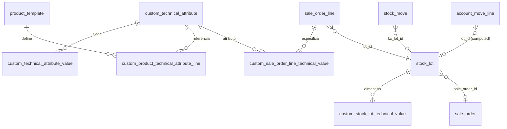
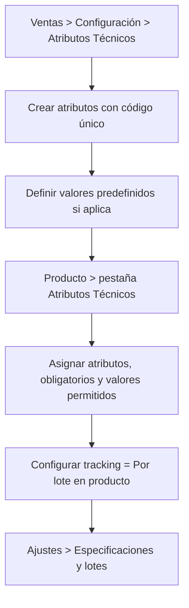
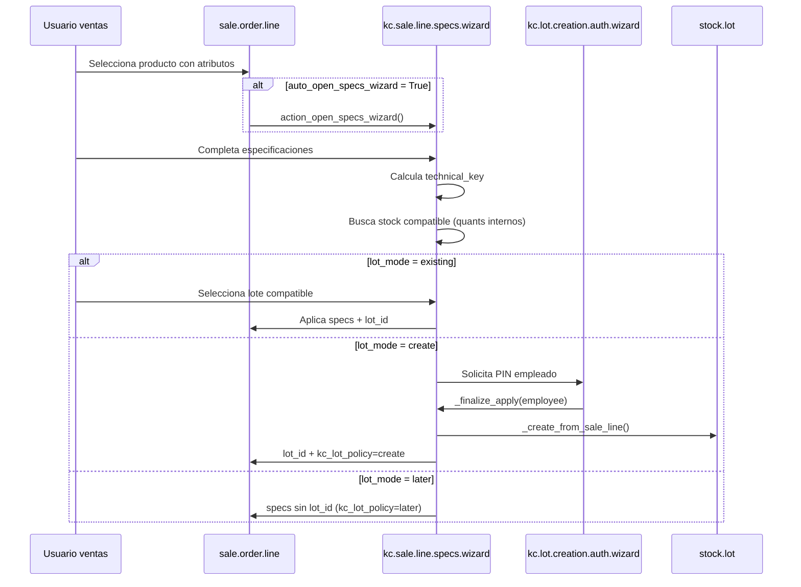
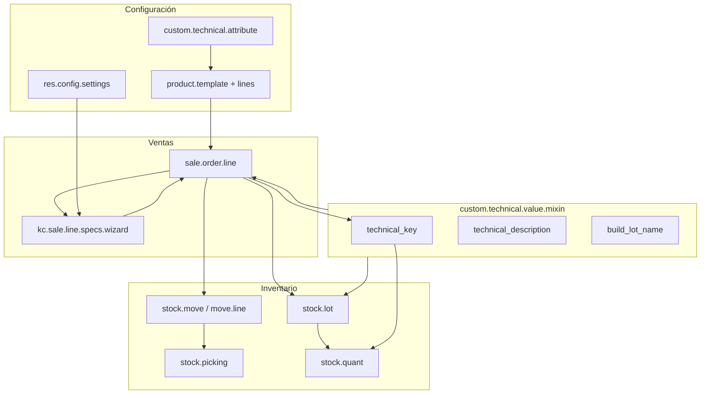

# KC Producto: Especificaciones Técnicas por Lote

**Módulo:** `kc_product_custom_specs_lot`  
**Versión:** 18.0.2.0.0  
**Autor:** KENOCIA  
**Plataforma:** Odoo 18  

---

## 1. Resumen ejecutivo

Este módulo resuelve un escenario industrial/comercial frecuente: **vender productos genéricos** (por ejemplo, perfiles, tubos, chapas) cuya variación real no está en el catálogo de productos, sino en **medidas y características técnicas** definidas en el momento de la venta.

La especificación técnica se captura en la **línea del pedido de venta**, se identifica mediante una **clave técnica normalizada** y se materializa en **inventario como lote/serie** (`stock.lot`). Así, el stock de un mismo SKU se diferencia por lote según sus medidas, no por variantes de producto.

### Problema de negocio que resuelve

| Sin el módulo | Con el módulo |
|---------------|---------------|
| Crear un producto por cada combinación de medidas | Un solo producto genérico con atributos dinámicos |
| Inventario agregado sin detalle dimensional | Stock trazable por lote con especificaciones |
| Cotización sin control de compatibilidad | Búsqueda de stock compatible por clave técnica |
| Creación de lotes sin gobernanza | Autorización por PIN de empleado (modo configurable) |

---

## 2. Alcance funcional

### 2.1 Capacidades principales

1. **Catálogo de atributos técnicos** reutilizables (Perfil, Ancho, Largo, Espesor, etc.).
2. **Configuración por producto** de qué atributos aplican, cuáles son obligatorios y qué valores están permitidos.
3. **Modal de configuración** al añadir productos con atributos en pedidos de venta.
4. **Tres políticas de lote** por línea: usar lote existente, crear lote nuevo o posponer asignación al despacho.
5. **Matching de stock** por `technical_key` entre venta e inventario.
6. **Validaciones en entrega** para garantizar que el lote despachado coincide con la especificación vendida.
7. **Trazabilidad** en lotes: origen, pedido, cliente, empleado autorizador.
8. **Detalle configurable en documentos** (cotización, pedido, factura) con o sin medidas y lote.
9. **Vista de inventario** por ubicación + producto + lote + especificaciones.
10. **Reportes PDF** de ficha técnica de lote y extensiones en documentos de venta/contabilidad.

### 2.2 Fuera de alcance (actual)

- La opción de configuración `from_mrp` (creación desde orden de producción) está **declarada pero no implementada**; si se selecciona, el wizard bloquea la creación manual.
- No hay integración automática con MRP en el código actual.

---

## 3. Dependencias

```text
sale_management
stock
account
uom
sale_stock
hr          ← PIN de empleado para autorización de lotes
```

---

## 4. Estructura del módulo

```text
kc_product_custom_specs_lot/
├── __manifest__.py
├── data/
│   └── ir_sequence_data.xml          # Secuencia stock.lot.technical
├── models/
│   ├── technical_mixin.py            # Lógica compartida (claves, nombres)
│   ├── technical_attribute.py        # Modelos maestros y valores por línea/lote
│   ├── product_template.py           # Atributos por producto
│   ├── sale_order.py                 # Flujo de venta
│   ├── stock_lot.py                  # Lotes técnicos
│   ├── stock_move.py                 # Propagación de lote a movimientos
│   ├── stock_picking.py              # Validación en entrega
│   ├── stock_quant.py                # Vistas de inventario técnico
│   ├── account_move.py               # Campos en facturación
│   └── res_config_settings.py        # Parámetros globales
├── wizard/
│   ├── sale_line_specs_wizard.py     # Modal principal de configuración
│   ├── lot_creation_auth_wizard.py   # Autorización PIN
│   ├── sale_confirm_lot_warn_wizard.py
│   ├── copy_technical_specs_wizard.py
│   └── compatible_lot_wizard.py      # (auxiliar, poco usado desde UI principal)
├── views/                            # Formularios y menús
├── reports/                          # QWeb PDF
└── security/
    └── ir.model.access.csv
```

---

## 5. Modelo de datos

### 5.1 Diagrama entidad-relación (simplificado)



### 5.2 Modelos nuevos

| Modelo técnico | Descripción funcional |
|----------------|----------------------|
| `custom.technical.attribute` | Maestro de características (nombre, código, tipo de captura, UoM). |
| `custom.technical.attribute.value` | Valores predefinidos para atributos tipo selección/radio. |
| `custom.product.technical.attribute.line` | Relación producto ↔ atributo con obligatoriedad, valores permitidos y default. |
| `custom.sale.order.line.technical.value` | Valores capturados en la línea de venta. |
| `custom.stock.lot.technical.value` | Valores persistidos en el lote de inventario. |
| `custom.technical.value.mixin` | Modelo abstracto con utilidades de formato (no tabla). |

### 5.3 Modelos extendidos

| Modelo Odoo | Extensiones relevantes |
|-------------|------------------------|
| `product.template` | `technical_attribute_line_ids`, `kc_invoice_detail_mode`, constraint de tracking por lote |
| `sale.order` / `sale.order.line` | Especificaciones, clave técnica, lote, política, stock compatible |
| `stock.lot` | Descripción/clave técnica, origen, trazabilidad comercial |
| `stock.move` / `stock.move.line` | `kc_lot_id`, validación de coherencia |
| `stock.picking` | Validación obligatoria de lote en salidas |
| `stock.quant` | Campos related de especificaciones; acciones de vista |
| `account.move.line` | Lote y descripción técnica desde venta |
| `res.config.settings` | Parámetros del módulo |

### 5.4 Tipos de atributo (`display_type`)

| Tipo | Campo de valor | Uso típico |
|------|----------------|------------|
| `selection` | `value_id` | Lista desplegable |
| `radio` | `value_id` | Opción única visual |
| `numeric` | `value_number` + `uom_id` | Medidas con unidad |
| `text` | `value_text` | Texto libre |

---

## 6. Conceptos clave

### 6.1 Descripción técnica (`technical_description`)

Texto legible multilínea generado automáticamente:

```text
Perfil: 2
Ancho: 4 m
Espesor: 1.5 mm
```

Se calcula en líneas de venta (stored) y lotes mediante el mixin `build_technical_description()`.

### 6.2 Clave técnica (`technical_key`)

Identificador **normalizado y comparable** usado para emparejar venta ↔ inventario.

**Formato:** `CODIGO_ATRIBUTO=VALOR|CODIGO_ATRIBUTO=VALOR|...`

**Ejemplo:**

```text
PERFIL=2|ANCHO=4M|ESPESOR=15MM
```

**Reglas de normalización** (`_normalize_token`):

- Mayúsculas
- Sin acentos (NFKD)
- Solo alfanuméricos en valores
- Números sin ceros trailing innecesarios

Esta clave es el **corazón del matching de stock compatible**.

### 6.3 Nomenclatura de lotes

Patrón generado por `build_lot_name()`:

```text
{CODIGO_PRODUCTO}{SPECS_COMPACTAS}_{YYYYMMDD}_{####}
```

**Ejemplo:** `BTELG24_20260521_0001`

| Segmento | Origen |
|----------|--------|
| Código producto | `default_code` o nombre, normalizado (máx. 12) |
| Specs compactas | Valores técnicos concatenados sin separador (máx. 24) |
| Fecha | Día de creación |
| Secuencia | `ir.sequence` código `stock.lot.technical` (padding 4) |

---

## 7. Flujos de negocio

### 7.1 Configuración inicial



**Restricción crítica:** si un producto tiene atributos técnicos, **debe** tener `tracking = 'lot'`. De lo contrario, Odoo lanza `ValidationError` al guardar.

### 7.2 Flujo de venta — modal de especificaciones



**Políticas de lote (`kc_lot_policy`):**

| Valor | Significado |
|-------|-------------|
| `existing` | Se reservará/despachará un lote ya existente con la misma clave |
| `create` | Se creó un lote nuevo (con autorización si aplica) |
| `later` | Cotización/pedido sin lote; se asignará al despachar |

### 7.3 Confirmación de pedido

1. Si hay líneas con specs pero sin lote y política `later`, aparece **wizard de advertencia** (`kc.sale.confirm.lot.warn.wizard`).
2. Tras confirmar (con o sin advertencia), se validan atributos obligatorios y clave técnica.
3. Al confirmar, `_kc_apply_lots_to_stock_moves()` propaga `lot_id` de la venta a `kc_lot_id` en movimientos de stock pendientes.

### 7.4 Flujo de entrega (outgoing)

En `stock.picking.button_validate()`:

- Para movimientos vinculados a líneas que requieren specs técnicas:
  - **Obligatorio** indicar lote en las líneas de movimiento.
  - El `technical_key` del lote debe coincidir con el de la venta.
- También existe constraint en `stock.move.line` que valida coherencia al guardar.

### 7.5 Facturación e impresión

En `product.template.kc_invoice_detail_mode`:

| Modo | Comportamiento |
|------|----------------|
| `product_only` | Solo nombre del producto en factura/línea |
| `technical` | Producto + descripción técnica + número de lote |

Afecta a `_prepare_invoice_line()` en ventas y plantillas QWeb de cotización/pedido/factura.

---

## 8. Wizards (asistentes transitorios)

| Wizard | Propósito |
|--------|-----------|
| `kc.sale.line.specs.wizard` | **Principal.** Configura specs, cantidad, modo de lote y stock compatible. |
| `kc.sale.line.specs.wizard.value` | Líneas de atributos dentro del modal. |
| `kc.sale.line.specs.wizard.compatible` | Tabla de lotes/ubicaciones compatibles. |
| `kc.lot.creation.auth.wizard` | Valida PIN de `hr.employee` antes de crear lote. |
| `kc.sale.confirm.lot.warn.wizard` | Confirma pedido pese a líneas sin lote. |
| `kc.copy.technical.specs.wizard` | Copia specs de otra línea del mismo pedido. |
| `kc.compatible.lot.wizard` | Selección alternativa de lote compatible (API disponible). |

### Contexto especial: `kc_from_specs_wizard`

Evita bucles al escribir líneas de venta desde wizards (no recarga atributos ni reabre modal, salta algunos constraints).

---

## 9. Configuración del sistema

**Ruta:** Ajustes → app **Especificaciones y lotes**

| Parámetro (`ir.config_parameter`) | Campo settings | Default | Efecto |
|-----------------------------------|----------------|---------|--------|
| `kc_product_custom_specs_lot.auto_open_specs_wizard` | `kc_auto_open_specs_wizard` | `True` | Abre modal al elegir producto |
| `kc_product_custom_specs_lot.allow_quote_without_lot` | `kc_allow_quote_without_lot` | `True` | Permite modo "cotizar sin lote" |
| `kc_product_custom_specs_lot.lot_creation_mode` | `kc_lot_creation_mode` | `manual_pin` | Modo creación (`from_mrp` no implementado) |
| `kc_product_custom_specs_lot.require_pin_lot_creation` | `kc_require_pin_lot_creation` | `True` | Exige wizard PIN al crear lote |

---

## 10. Seguridad y permisos

### 10.1 Grupos implicados

- `base.group_user`: lectura básica de atributos
- `sales_team.group_sale_salesman`: CRUD atributos (sin delete manager)
- `sales_team.group_sale_manager`: CRUD completo atributos
- `stock.group_stock_user`: CRUD completo valores técnicos en lotes

### 10.2 Autorización PIN

- Usa el campo nativo `hr.employee.pin`
- Solo empleados con PIN configurado aparecen en el dominio
- El empleado autorizador queda registrado en `stock.lot.kc_authorized_employee_id`

---

## 11. Vistas y menús

| Menú | Ubicación Odoo | Acción |
|------|----------------|--------|
| Atributos Técnicos | Ventas → Configuración | CRUD `custom.technical.attribute` |
| Valores de Atributos | Ventas → Configuración | CRUD `custom.technical.attribute.value` |
| Existencias por lote y especificación | Inventario → Control de inventario | Vista `stock.quant` técnica |

### Extensiones UI destacadas

- **Pedido de venta:** botón ⚙ en línea, descripción técnica, lote, copiar specs
- **Producto:** pestaña "Atributos Técnicos"
- **Lote/serie:** resumen técnico + pestaña de valores
- **Inventario producto:** botón "Por lote" en vista de existencias Odoo 18

---

## 12. Reportes

| Reporte | Modelo | Descripción |
|---------|--------|-------------|
| Ficha técnica de lote | `stock.lot` | PDF con specs, clave, autorizador, qty |
| Cotización / Pedido | `sale.order` | Muestra specs y lote si `kc_invoice_detail_mode=technical` |
| Factura | `account.move` | Idem según configuración de producto |
| Movimientos stock | `stock.picking` | Extensiones en plantillas de albarán |

---

## 13. Lógica técnica del mixin

Archivo central: `models/technical_mixin.py`

```python
# Métodos principales (referencia)
_normalize_token(value)           # Normalización alfanumérica
_format_display_value(tech_value) # Texto humano
_format_key_value(tech_value)     # Par (código, valor) para clave
build_technical_description(...)  # Descripción multilínea
build_technical_key(...)          # Clave pipe-separated
build_lot_specs_compact(...)      # Segmento compacto para nombre lote
build_lot_name(...)               # Nomenclatura completa
```

**Herencia del mixin:**

- `custom.sale.order.line.technical.value`
- `custom.stock.lot.technical.value`

Ambos delegan en los mismos algoritmos para garantizar **consistencia venta ↔ lote**.

---

## 14. Búsqueda de stock compatible

Algoritmo en `sale.order.line._search_compatible_lots()` y wizard:

1. Filtrar lotes del mismo `product_id`.
2. Comparar `technical_key` exacta.
3. Opcionalmente filtrar `product_qty > 0`.
4. En wizard, cruzar con `stock.quant` en ubicaciones `internal` para mostrar disponible por ubicación.

**Importante:** el matching es por **igualdad exacta de clave**, no por similitud parcial. Dos combinaciones con el mismo significado pero distinta normalización no coincidirán.

---

## 15. Puntos de extensión y customización

### 15.1 Para desarrolladores

| Punto | Uso recomendado |
|-------|-----------------|
| Heredar `custom.technical.value.mixin` | Cambiar reglas de clave o nombre de lote |
| Override `_create_from_sale_line` | Integrar creación desde MRP u otro origen |
| Override `_requires_technical_specs` | Ampliar criterio (ej. servicios, consumibles) |
| Nuevo `source_type` en `stock.lot` | Orígenes adicionales de lote |
| Extender `kc_invoice_detail_mode` | Más modos de impresión |

### 15.2 Implementación futura sugerida (`from_mrp`)

La configuración ya reserva el valor `from_mrp`. Para completarlo habría que:

1. Crear lotes desde `mrp.production` al finalizar MO.
2. Copiar specs desde orden de producción o BOM.
3. Deshabilitar creación manual vía wizard (ya parcialmente hecho).

---

## 16. Reglas de validación (resumen)

| Momento | Validación |
|---------|------------|
| Guardar producto | Atributos técnicos ⇒ tracking por lote |
| Guardar atributo | Código único, sin espacios |
| Wizard specs | Obligatorios, clave válida, valores permitidos |
| Confirmar pedido | Atributos requeridos + clave técnica |
| Confirmar sin lote | Advertencia si política `later` |
| Guardar move line | Lote coherente con clave de venta |
| Validar picking salida | Lote obligatorio y clave coincidente |
| Crear lote | PIN correcto (si configurado) |

---

## 17. Diagrama de arquitectura por capas



---

## 18. Casos de uso de referencia

### Caso A — Hay stock compatible

1. Vendedor añade "Perfil aluminio" al pedido.
2. Modal: Perfil=2, Ancho=4m → clave `PERFIL=2|ANCHO=4M`.
3. Sistema detecta 10 uds en lote `BTELG24_20260301_0003`.
4. Modo **existing** → selecciona lote.
5. Al confirmar, movimiento de stock lleva `kc_lot_id`.

### Caso B — Sin stock, crear lote

1. Specs nuevas sin match en inventario.
2. Modo **create** → PIN de supervisor.
3. Se crea lote `BTELG24_20260603_0042` con trazabilidad.
4. El lote existe pero qty=0 hasta recepción/producción manual.

### Caso C — Cotizar sin lote

1. Modo **later** (si permitido en settings).
2. Pedido confirmado con advertencia.
3. En albarán de entrega, operario **debe** asignar lote con la misma clave.

---

## 19. Checklist de despliegue

- [ ] Instalar módulo y dependencias (`hr` para PIN).
- [ ] Crear atributos técnicos con códigos estables (no cambiar tras datos en producción).
- [ ] Configurar productos genéricos con tracking por lote.
- [ ] Definir PIN en empleados autorizados.
- [ ] Revisar ajustes: modal automático, cotizar sin lote, PIN obligatorio.
- [ ] Capacitar ventas en modal y operaciones en validación de albaranes.
- [ ] Probar flujo completo: cotización → confirmación → entrega → factura.

---

## 20. Glosario

| Término | Definición |
|---------|------------|
| **Atributo técnico** | Dimensión configurable (ej. Ancho) independiente de variantes Odoo |
| **Clave técnica** | Huella normalizada para identificar una combinación de valores |
| **Lote técnico** | Registro `stock.lot` cuya identidad incluye especificaciones |
| **Política de lote** | Decisión comercial sobre cuándo/cómo se asigna el lote |
| **Stock compatible** | Inventario disponible cuyo lote tiene la misma clave técnica |

---

*Documento generado para Odoo 18 — módulo `kc_product_custom_specs_lot` v18.0.2.0.0*
